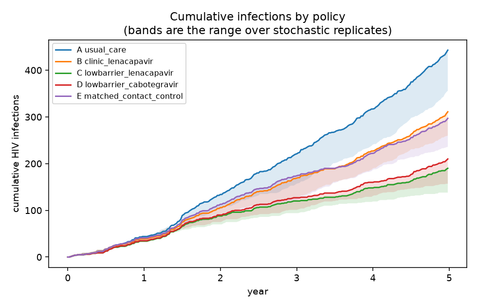
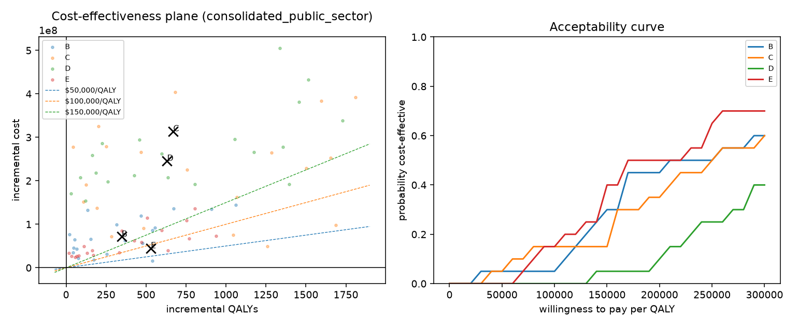
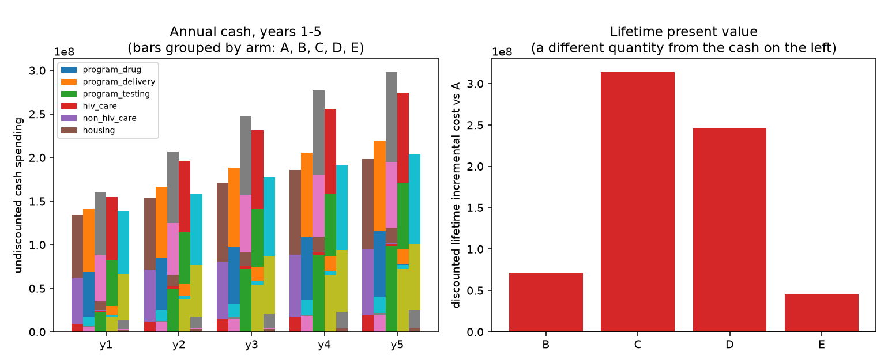
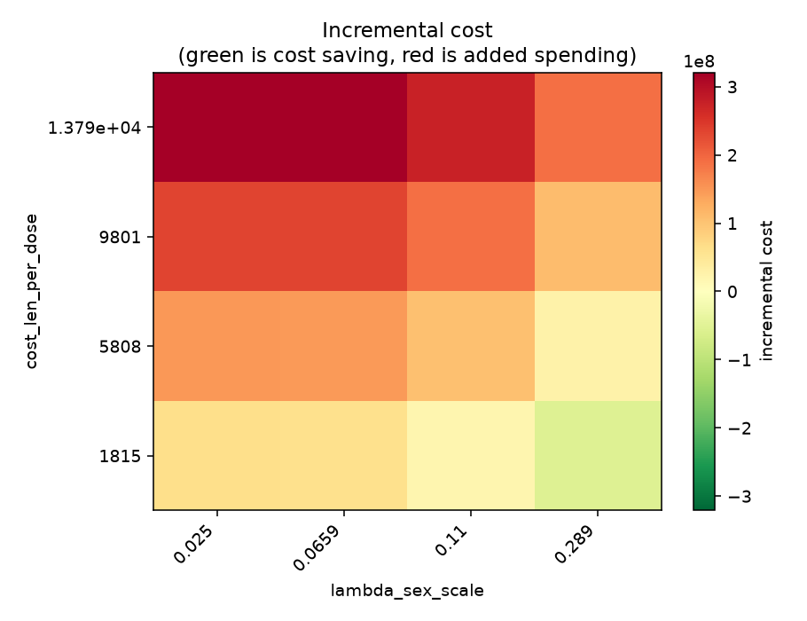
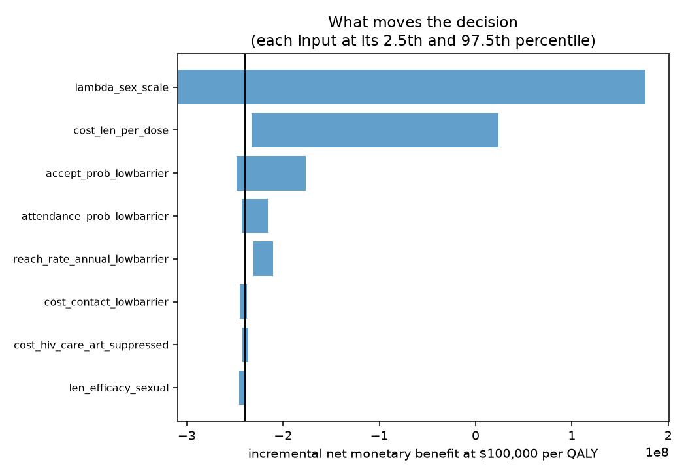
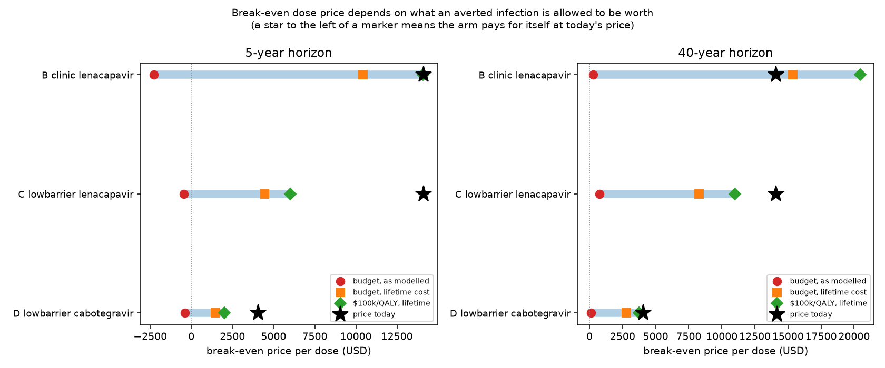
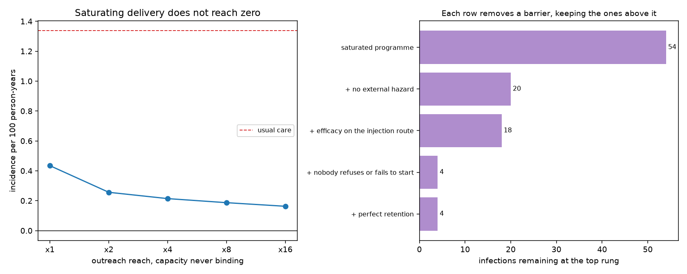

# Injectable PrEP for people experiencing homelessness

A transmission microsimulation and economic evaluation of long-acting injectable
PrEP (lenacapavir, with cabotegravir as a comparator) delivered to adults
experiencing homelessness in one catchment.

**Nothing here is a real-world measurement.** Every calibration target and most
delivery inputs are flagged `hypothetical`: defensible placeholders with stated
ranges, standing in for local data that would need a data-use agreement. 107 of
118 parameter rows carry no source URL. The only input with a real citation is
the lenacapavir dose price. The model is a structure for a decision, not an
answer to one, and the report says so on its first page.

---

## The short version

At today's prices, **injectable PrEP does not pay for itself in this
population**, and the reason is not the drug's efficacy — it is the delivery
cost per infection actually averted, plus an accounting boundary that decides
how much an averted infection is allowed to be worth.

Three findings are worth more than the headline ICER:

1. **The intervention that looks best isn't the injection.** Arm E — the same
   outreach, testing and ART linkage with *no* injectable — is the most
   cost-effective arm at both horizons ($84,691/QALY at 5 years, improving to
   $72,577 at 40). Showing up is doing much of the work the drug is being
   credited for.
2. **The break-even dose price spans −$443 to $20,478** depending on accounting
   choices — a range wider than the price itself. Which number you quote is
   decided by whether out-migration is a real saving or a boundary artifact.
3. **Elimination is not purchasable here.** Saturating delivery takes incidence
   from 1.337 to 0.163 per 100 person-years and stops. 63% of what remains
   arrives from outside the population, and cost per infection averted *rises*
   with scale.

---

## Results

All figures are regenerated by `python -m prep_model.writeup` from saved runs.
Two horizons are reported throughout: `config/dev.yaml` (5,000 people, 5 years)
and `config/lifetime.yaml` (5,000 people, 40 years). The long horizon exists
because the terminal value freezes each person in whatever health state they
occupied when the clock stopped, which undercounts the cost of an infection
specifically in the arm that prevents infections.

### Does it avert infections? Yes, unambiguously.



Every arm gains QALYs in every one of the 20 probabilistic draws
(`P(QALY gain) = 1.0`). The health effect is not in doubt. What is in doubt is
its size and its price.

| arm | averted (5y) | ΔQALY (5y) | ICER (5y) | averted (40y) | ΔQALY (40y) | ICER (40y) |
|---|---|---|---|---|---|---|
| B clinic lenacapavir | 114 | 347 | $205,342 | 1,376 | 774 | $667,669 |
| C low-barrier lenacapavir | 236 | 670 | $468,567 | 3,706 | 1,805 | $1,450,148 |
| D low-barrier cabotegravir | 216 | 632 | $389,378 | 3,259 | 1,641 | $1,171,363 |
| E matched contact control | 133 | 530 | **$84,691** | 1,752 | 1,220 | **$72,577** |

Consolidated public-sector perspective, incremental against usual care.

Those are pairwise ICERs against usual care, which is *not* the same as the
efficiency frontier. On the frontier, **arm B is dominated at both horizons** —
it costs more than arm E and buys fewer QALYs — and at 40 years **arm D is
extended-dominated** as well. What survives is:

| horizon | frontier | dropped |
|---|---|---|
| 5 years | A → E → D → C | B dominated |
| 40 years | A → E → C | B dominated, D extended-dominated |

Arm E is the first thing you buy at either horizon, and the step from E to
anything injectable costs between $1.7M and $4.3M per QALY.

### How many lives?

HIV deaths over the run, against 42 (5-year) and 574 (40-year) under usual care:

| arm | 5-year deaths averted | 40-year deaths averted |
|---|---|---|
| B clinic lenacapavir | 8 | 150 |
| C low-barrier lenacapavir | 16 | 339 |
| D low-barrier cabotegravir | 16 | 309 |
| E matched contact control | 13 | 280 |

These are single-replicate counts. The replicate standard deviation of
infections averted is roughly a fifth of its mean, so treat the ordering
between C and D at 5 years as noise, not a finding.

### Is it cost-effective? Almost certainly not at $100k/QALY.



Probability cost-effective at $100,000/QALY: **arm C 15%, arm B 5%, arm D 0%,
arm E 15%** (rising to 40% at $150,000). Probability cost-*saving*: **zero for
every arm**. The 95% interval on infections averted for arm C is **28 to 873** —
an interval that spans "barely worth doing" to "transformative", which is the
honest width given 20 draws over mostly hypothetical parameters.



The two panels are deliberately on separate axes. A present-value offset that
arrives over decades is not money a budget holder has next year.




### What price would make it work?



Total cost is affine in the dose price and nothing in the model reacts to price,
so the break-even price is solved exactly rather than searched: the discounted
dose count is the slope.

**5-year horizon**

| arm | price today | budget, as modelled | budget, lifetime | $100k/QALY, lifetime | cut to reach $100k col. |
|---|---|---|---|---|---|
| B clinic lenacapavir | $14,109 | -$2,273 | $10,419 | $14,064 | 0.3% |
| C low-barrier lenacapavir | $14,109 | -$443 | $4,441 | $6,021 | 57.3% |
| D low-barrier cabotegravir | $4,049 | -$398 | $1,450 | $2,014 | 50.3% |

**40-year horizon**

| arm | price today | budget, as modelled | budget, lifetime | $100k/QALY, lifetime | cut to reach $100k col. |
|---|---|---|---|---|---|
| B clinic lenacapavir | $14,109 | $268 | $15,359 | $20,478 | **−45.1%** |
| C low-barrier lenacapavir | $14,109 | $769 | $8,267 | $10,980 | 22.2% |
| D low-barrier cabotegravir | $4,049 | $107 | $2,775 | $3,734 | 7.8% |

The three columns differ only in **what an averted infection is allowed to be
worth**:

- *budget, as modelled* credits only the care cost the simulation books, which
  stops the moment a person leaves the modelled population;
- *budget, lifetime* credits the whole mortality-limited treatment stream
  ($461,592 net, replacing the simulation's credit rather than adding to it);
- *$100k/QALY, lifetime* additionally values the 1.44 QALYs an infection costs.

**The choice between the first two is not a modelling detail — it is a question
about who is asking.** A city programme genuinely stops paying when a client
moves away, and on that basis you would have to be *paid* $443 a dose to break
even. A national payer does not: Medicaid follows the person across state lines,
and the cost has left the spreadsheet rather than the world. On that basis
low-barrier lenacapavir breaks even around **$8,300 a dose — a 41% discount**.

The unexpected result is **arm B**: clinic-delivered lenacapavir breaks even at
$15,359 over 40 years, *above* what a dose costs today. It averts an infection
every 28 doses where low-barrier delivery needs 53, because clinic attendees are
a more reachable, higher-yield group.

That does not make it the arm to fund, and the two facts sit together
uncomfortably on purpose. B averts 1,376 infections against C's 3,706, and it is
**dominated on the frontier** — arm E reaches more people for less money. A dose
given through arm B pays for itself; the *programme* still loses to simply
showing up. **Efficiency per dose and value per dollar point at different arms
here**, and a programme has to be explicit about which one it is buying.

### Could you just eliminate HIV in this population?



`python -m prep_model.elimination` raises outreach reach and delivery capacity
together until capacity can never bind, then removes the model's structural
barriers one at a time to see what is still standing.

| programme | incidence /100py | infections | mean coverage | incremental cost | per infection averted |
|---|---|---|---|---|---|
| usual care | 1.337 | 443 | — | — | — |
| reach ×1 | 0.434 | 144 | 41.2% | $391,513,133 | $1,309,408 |
| reach ×4 | 0.214 | 71 | 55.6% | $511,226,117 | $1,374,264 |
| reach ×16 | 0.163 | 54 | 60.9% | $557,783,416 | **$1,433,891** |

Three things this says:

- **Incidence flattens well above zero.** Sixteen times the outreach buys less
  than the first doubling did.
- **Cost per infection averted rises with scale**, from $1.31M to $1.43M. There
  is no volume discount; you exhaust the reachable, high-yield people first.
- **Coverage plateaus at 60.9%** — and the ceiling is refusal and failure to
  initiate, *not* lapse. Removing refusal and initiation barriers takes coverage
  to 93%; adding perfect retention on top moves it 0.1 points, because when
  capacity never binds a missed visit is simply retried next week.

Decomposing the 54 infections that survive a saturated programme:

| assumption removed (cumulative) | infections left |
|---|---|
| saturated programme | 54 |
| + no external hazard | 20 |
| + efficacy on the injection route | 18 |
| + nobody refuses or fails to start | 4 |
| + perfect retention | 4 |

**63% of the residual arrives from outside the population.** No amount of
internal coverage touches it. Elimination is not a delivery problem, so its cost
is not a number this model can produce.

---

## The finding that shapes every number above

The model recovers only a fraction of what an averted infection would really
cost, and it loses it from the arm that averts infections. **The bias runs
against prevention.**

Out-migration ends a person's cost stream exactly as death does. At 12% a year
on top of mortality, the treatment cost of an infection is worth **5.07
discounted years against 12.96 on mortality alone — 39%.** The health side is
truncated the same way: the simulation books **0.49–0.56 QALYs** per averted
infection where the analytic lifetime burden is **1.44**.

Three dollar figures follow, and they are easy to confuse:

| | |
|---|---|
| $472,206 | lifetime HIV care — $36,444/yr × 12.96 discounted years |
| $184,827 | the same, truncated by the migration hazard (× 5.07 years) |
| $105,378 | what the simulation actually books per infection averted |

The last is lower than the second because infected people spend time
undiagnosed and unsuppressed, costed below the ART rate.

**The migration rate is among the most consequential parameters in the model and
it is graded D — hypothetical.** Cutting it from 12% to 1% a year roughly doubles
the recovered cost per infection, to $213,210 — and also raises total infections
in every arm, because people stay exposed for longer. If you improve one input
before quoting any of this, improve that one.

---

## What question it answers

Three claims are kept apart, because they are different claims and only the
first two are usually earned:

1. **Health benefit** — infections averted and QALYs gained.
2. **Cost-effectiveness** — cost per QALY against a stated willingness to pay.
3. **Cost saving** — total spending falls. Ordinary shelter expenditure is a
   background service present in both arms, and the HIV-attributable housing
   saving is zero unless somebody supplies a sourced value for it.

Costs live in separate category ledgers and a *perspective* is a set of
categories, so "can the programme operator fund delivery?" and "does total
public spending fall?" are answered from the same run without one being
silently substituted for the other.

## Install and run

```sh
uv venv && uv pip install -e '.[dev]'

python -m prep_model.validate    --config config/dev.yaml --smoke
python -m prep_model.calibrate   --config config/dev.yaml
python -m prep_model.run         --config config/dev.yaml --calibration outputs/dev/calibration.json
python -m prep_model.analyze     --run-dir outputs/dev
python -m prep_model.elimination --config config/dev.yaml --arm C --out outputs/dev/elimination.json
python -m prep_model.writeup
```

`config/dev.yaml` is 5,000 people over 5 years and finishes in a few minutes;
`config/base.yaml` is 20,000 over 10 years; `config/lifetime.yaml` runs 40 years
so the cascade can actually happen inside the simulation rather than being
annuitised at the horizon. The report lands at `outputs/<run_name>/report.md`
with its figures beside it. `writeup` runs no simulation — it reads saved runs
and rebuilds the figures this page embeds.

The commands are separate on purpose:

- **validate** audits the registry and smoke-runs every arm. It does not model.
- **calibrate** fits usual care only, keeps an ensemble rather than a point, and
  scores held-out targets that were not fitted.
- **run** does the policy experiments and writes JSON. Nothing is formatted here.
- **analyze** re-simulates the base case from the recorded seed and **refuses to
  write a report** if it disagrees with what `run` wrote, then builds the tables
  and figures. A long run is never repeated to change a table.
- **elimination** raises reach and capacity to saturation and decomposes the
  residual.
- **writeup** assembles the tracked `figures/` this page uses.

## The five arms

| id | arm | delivery | product |
|---|---|---|---|
| A | usual care | — | — |
| B | clinic lenacapavir | existing clinics | lenacapavir |
| C | low-barrier lenacapavir | walk-in, mobile, shelter-based, with navigation | lenacapavir |
| D | low-barrier cabotegravir | same outreach | cabotegravir |
| E | matched contact control | same outreach, no injectable uptake | — |

Arm E separates the effect of the *drug* from the effect of *showing up*: the
same outreach, testing and ART linkage without the injection. It is a modelling
counterfactual, not a proposal to withhold care — and it is the arm that comes
out best.

## How the model is put together

- `rng.py` — counter-based draws keyed on `(seed, stream, step, person)`. No
  stream state, so two arms that should be identical are bit-identical.
- `population.py` — a pre-allocated cohort with a deterministic entry schedule.
  Arms cannot diverge in who exists or when.
- `transmission.py` — group-based mixing, infectiousness-weighted prevalence
  recomputed every step. Freezing it gives the direct-effects-only sensitivity.
- `natural_history.py` — stages, cascade, and death and out-migration as
  coherent competing hazards: one draw for whether a person leaves, a second to
  split the cause, so nobody both dies and migrates in one interval.
- `delivery.py` — the programme as a delivery system: capacity, refusal, failure
  to initiate after accepting, screening, late visits, discontinuation,
  re-engagement, and cost for contacts that produce no injection.
- `prep.py` — protection that wanes linearly past the due date rather than
  falling off a cliff, and is route-specific.
- `economics.py` — category ledgers, QALYs, and a terminal value that covers
  only time strictly beyond the horizon, at the same state-specific costs the
  simulation used.
- `experiments.py` — ICERs with simple *and* extended dominance removed, net
  benefit, one- and two-way sweeps, the scenario grid, structural sensitivity,
  and a PSA that draws calibrated parameters from the accepted ensemble.
- `analytic.py` — the transparent order-of-magnitude check, the lifetime burden
  of one infection, and the break-even price bases.
- `elimination.py` — the saturation ladder and the residual decomposition.

Three things the code is built to refuse:

- **No efficacy cliff.** Protection does not drop to zero the day a dose is due.
- **No perfect protection.** Efficacy against the equipment-sharing route is set
  to zero as a conservative structural assumption and relaxed only in
  sensitivity; it is never silently borrowed from the sexual-route trial result.
- **No double counting.** A lifetime HIV cost is not added on top of simulated
  care, and longer survival keeps accruing non-HIV care and housing costs rather
  than being treated as free. An infection *saves* money by shortening a life,
  and that offset is reported rather than suppressed.

## Parameters

`data/parameters.csv` is the single source of every number. Fifteen columns,
including the distribution, an evidence grade A–D, and an assumption flag from
`observed_local | transported | calibrated | hypothetical`. An unknown parameter
name raises rather than resolving to zero, an override must name a real row, and
the registry records which rows a run actually read — so the report can list the
hypothetical inputs that were used and the rows that were not.

**Most rows carry no source URL. That is the model's main evidential
limitation** and the report states it as one. In particular there is **no
Medicaid claims data anywhere in this model**; the HIV care costs are grade C/D
placeholders.

## What the tests are for

`pytest` runs 80 checks in about 35 seconds. They target failure modes that
would change a decision:

- zero hazard gives zero infections; zero uptake reproduces usual care; zero
  efficacy leaves the testing effect intact;
- perfect sexual protection does **not** block the injection route;
- nobody is infected twice, prescribed prevention instead of treatment, or
  accrues life-years after death; the population reconciles;
- **two identical arms produce exactly zero incremental outcomes** — not "within
  stochastic error". If they differ at all, the random streams have slipped and
  every incremental result is contaminated by noise that looks like an effect;
- a shared background cost cancels in the difference; a higher price raises cost
  without touching the epidemic and lowers net benefit;
- the break-even price is *solved*, not searched, and the test re-runs the model
  at the returned price and requires the incremental cost to be zero;
- saturating delivery must **not** drive infections to zero, because there is an
  external hazard and an unprotected route that no programme reaches;
- the lifetime burden's uncomfortable term — that dying sooner is cheaper — is
  present, negative, and smaller than the treatment cost it offsets.

One test is worth reading before trusting any single run.
`test_a_finer_step_and_a_larger_cohort_move_nothing_the_replicate_noise_does_not`
exists because halving the step changes every step index and is therefore a new
seed, not a more precise version of the same run. This epidemic feeds back
through a small, nine-times-infectious acute compartment, and the replicate
standard deviation of infections averted is roughly a fifth of its mean. **A
single run is not a result.** `stochastic_replicates` is set low for speed;
raise it before quoting a number.

## The reinforcement learning environment

`prep_model/env.py` wraps the same simulation as a sequential decision problem.
It is deliberately *behind* the cost-effectiveness analysis rather than under it:
the CEA does not import it, and nothing in the report depends on it.

```python
from prep_model.config import load_config
from prep_model.params import Registry
from prep_model.env import PrepEnv, compare, constant_policy, seed_bank

cfg = load_config("config/base.yaml")
params = Registry.load().resolve(cfg.price_year, overrides=cfg.overrides)
env = PrepEnv(cfg, params, arm_id="C", wtp=100_000.0)

train, held = seed_bank(cfg.seed, 32, held_out=16)
serve_highest_exposure_first = constant_policy((1.0, 1.0, 1.0, 0.0, 0.0, 0.0))
print(compare(env, serve_highest_exposure_first, seeds=held))
```

A step is one week. The **action** is six numbers: the share of contact capacity
reserved for scheduled injection visits, and five weights over the features a
priority score may be built from — exposure group, sleeping outside, sharing
equipment, how overdue a visit is, and whether one was already missed. Every one
of those is something an outreach worker could know at the door. The latent
engagement propensity that actually drives retention is *not* available to the
policy, because a policy that used it could not be run.

The **observation** is thirteen numbers a programme could genuinely see: its own
throughput and queue, coverage and lapse rates, the exposure mix of the people it
is in contact with. True prevalence and incidence are withheld.

The **reward** is the increment in net monetary benefit, `wtp * ΔQALYs − Δcost`,
per 1000 population, terminal value included in the final step. Summed over an
episode it equals exactly what the evaluation would report for that arm, which a
test asserts. Because the environment is seeded by counter-based RNG, two
policies run on the same seed share every draw they do not change, so the
difference in returns *is* the incremental net benefit — no control arm has to be
simulated to get it.

Only one thing about the world can be changed, and only where the model says a
policy could: the rationing of finite weekly capacity, via `DeliveryPlan`.
`DeliveryPlan()` with its defaults is the model's own hard-coded policy, so the
default action reproduces `simulate.run_arm` bit for bit. When capacity is not
binding, no action changes anything — also a test.

Three caveats, which are why this is a side door and not the front one:

1. **The noise floor is high.** Any policy gradient computed from unpaired
   episodes is mostly estimating the seed. Use `compare`, which pairs on common
   random numbers.
2. **The model is under-determined, and an optimizer will find that out.** A
   policy tuned against transported and hypothetical parameters is tuned against
   assumptions. `seed_bank(..., held_out=n)` lets a claimed improvement be
   checked on seeds it was not fitted to; it cannot check it on parameters it
   was not fitted to.
3. **It answers a question nobody asked.** Whether the programme is worth
   funding is what `run` and `analyze` report. Which of two people in a queue to
   serve first is worth asking only once the first question has been answered.

## What would change the answer

In rough order of leverage:

1. **A sourced out-migration rate.** It decides whether the break-even price is
   −$443 or $8,267.
2. **Real HIV care costs** — ideally Medicaid claims for this population rather
   than grade C/D placeholders.
3. **Whether the payer is local or national.** Same model, different column.
4. **Delivery cost per contact.** The drug price is not the binding constraint
   for arm E, which is the arm that already works.
5. **Efficacy against the equipment-sharing route**, currently assumed zero.
   Relaxing it to 0.70 removes only 2 of 54 residual infections at saturation,
   so this is lower leverage than it looks.

## Layout

```
config/     base.yaml, dev.yaml, lifetime.yaml
data/       parameters.csv, sources.csv, price_index.csv
prep_model/ the model, the commands, env.py, elimination.py, writeup.py
tests/      invariants, machinery, env, burden, elimination, price bases
figures/    tracked; rebuilt by python -m prep_model.writeup
outputs/    written by run and analyze; not checked in
```
